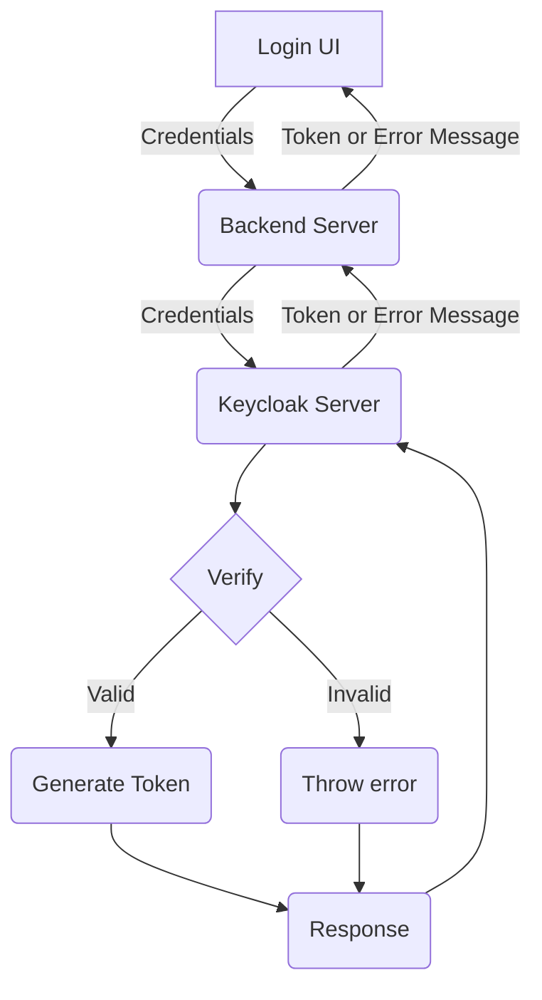

# AR Digi Companion

This application is design as a Springboot application

## Development

### Setup Keycloak API for App integration and Security

#### Step 1:
Keycloak getting started [documentation](https://www.keycloak.org/docs/latest/getting_started/index.html) to run and setup keycloak admin user.

access keycloak admin console using [http://localhost:8080/auth](http://localhost:8080/auth)

#### Login - Keycloak Flow Chart

[External Keycloak blog reference](https://medium.com/@bcarunmail/securing-rest-api-using-keycloak-and-spring-oauth2-6ddf3a1efcc2) 